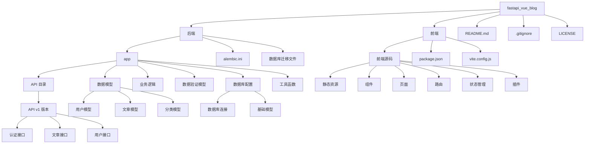

# FastAPI + Vue3 + PostgreSQL 个人博客系统

一个使用 FastAPI 后端、Vue3 前端和 PostgreSQL 数据库构建的现代化个人博客系统。

## 项目结构



## 技术栈

- **后端**: FastAPI, PostgreSQL, SQLAlchemy, Pydantic, JWT
- **前端**: Vue3, Vite, Naive UI, Axios
- **开发工具**: Git, VSCode, Docker (可选)

## 启动步骤

### 1. 准备环境

#### 1.1 安装依赖
```bash
# 后端依赖
cd backend
pip install -r requirements.txt

# 前端依赖
cd ../frontend
npm install
```

#### 1.2 配置数据库
```bash
# PostgreSQL 初始化
# 1. 登录 PostgreSQL
psql -U postgres

# 2. 创建数据库和用户
CREATE DATABASE blog_db;
CREATE USER blog_user WITH PASSWORD 'your_secure_password';
ALTER ROLE blog_user SET client_encoding TO 'utf8';
ALTER ROLE blog_user SET default_transaction_isolation TO 'read committed';
ALTER ROLE blog_user SET timezone TO 'UTC';
GRANT ALL PRIVILEGES ON DATABASE blog_db TO blog_user;

# 3. 退出 PostgreSQL
\q

# 4. 从 .env 文件加载配置（已在项目中提供模板）
# 编辑 backend/.env 文件，设置数据库连接信息
```

### 2. 启动后端服务
```bash
# 进入后端目录
cd backend

# 启动 FastAPI 服务
uvicorn app.main:app --reload --host 0.0.0.0 --port 8000
```

### 3. 启动前端服务
```bash
# 进入前端目录
cd frontend

# 启动开发服务器
npm run dev
```

### 4. 访问系统
- 后端 API 文档: http://localhost:8000/docs
- 前端页面: http://localhost:3000
