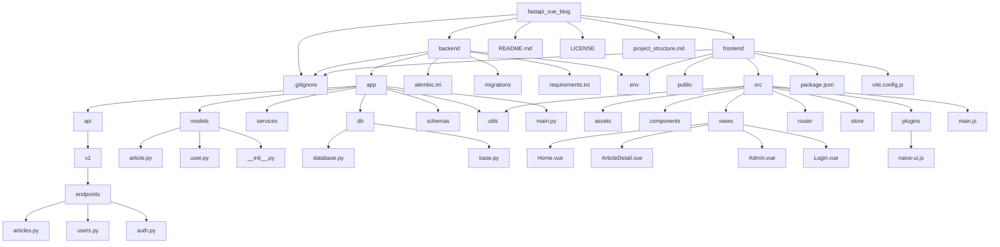

# FastAPI + Vue3 个人博客项目结构

## 项目目录结构

## 目录说明

### 后端 (backend)
- **app/api**: API路由定义，按版本(v1)和功能模块组织
- **app/models**: 数据库模型定义(SQLAlchemy)
- **app/services**: 业务逻辑层
- **app/db**: 数据库连接和配置(PostgreSQL)
- **app/schemas**: Pydantic模型，用于请求/响应验证和序列化
- **app/utils**: 工具函数
- **migrations**: Alembic数据库迁移文件
- **requirements.txt**: Python依赖
- **.env**: 环境变量配置(数据库连接等敏感信息)

### 前端 (frontend)
- **src/assets**: 静态资源(图片、样式等)
- **src/components**: 可复用组件
- **src/views**: 页面级组件
- **src/router**: 路由配置
- **src/store**: 状态管理
- **src/plugins**: 插件配置(Naive UI等)
- **package.json**: Node依赖
- **vite.config.js**: Vite构建配置